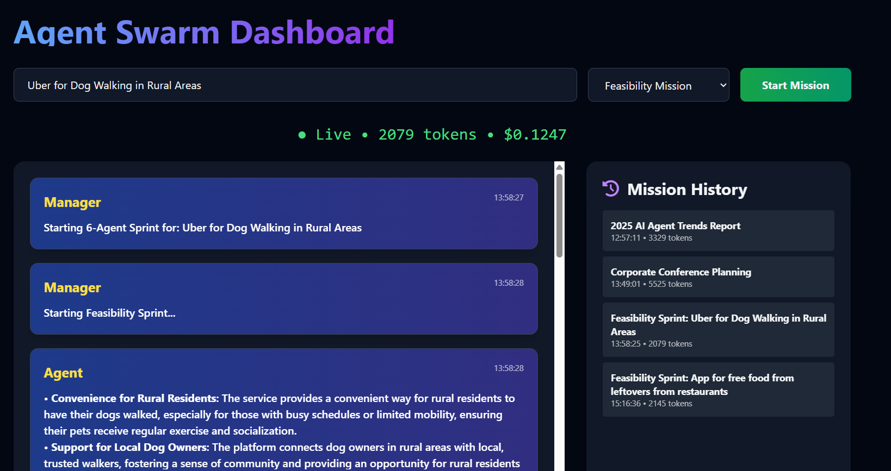
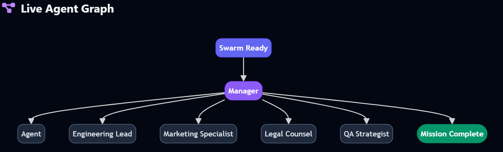

# Agent Swarm Dashboard

## Overview

The Agent Swarm Dashboard is a web-based interface for managing and visualizing agent-based missions powered by multi-agent systems. It allows users to initiate different types of missions (e.g., swarm operations for research and content creation, feasibility analysis for business ideas, or comprehensive conference planning), monitor live progress via a timeline and graph, and review historical runs. Built as a full-stack application using Django for the backend and Tailwind CSS/jQuery for the frontend, it leverages real-time updates via Server-Sent Events (SSE) for an interactive experience. The dashboard ensures only one mission runs at a time to prevent overlaps, with missions orchestrated using CrewAI and integrated with Groq's LLM via LangChain for efficient AI-driven workflows.


## Screenshots

### Dashboard View


### Live Agent Graph



## Features

- **Mission Selection and Initiation**: Users can input a mission name and select from three mission types (Feasibility Mission, Swarm Mission, or Conference Planning) via a dropdown. A "Start Mission" button launches the selected mission, with button disabling to enforce single-mission execution.
- **Single Mission Enforcement**: The start button disables during an active mission and re-enables upon completion, ensuring only one mission is in progress at any time.
- **Live Timeline**: Displays real-time agent messages with timestamps, agent names, and formatted content (supports basic Markdown rendering like bold, italics, and code blocks). Updates via Server-Sent Events (SSE) for seamless live streaming.
- **Mission History**: A sidebar listing past missions with names, start times, and token usage. Each entry is clickable to view detailed runs.
- **Live Agent Graph**: Visualizes the agent workflow using Mermaid.js flowcharts, showing states like "Swarm Ready", "Manager", individual agents, and "Mission Complete".
- **Status Bar**: Shows live status (e.g., "Live • X tokens • \$Y cost") with token counting and estimated cost calculation (based on a rate of $0.00006 per token).
- **Responsive Design**: Mobile-friendly layout using Tailwind CSS, with dark mode enabled by default.
- **Error Handling and Retries**: SSE connections auto-reconnect on errors with exponential backoff.
- **Backend Mission Dispatch**: Missions are handled asynchronously via Django views, calling specific CrewAI-orchestrated functions like `run_feasibility_mission`, `run_swarm_mission`, or `run_conference_planing`. Outputs are published to Redis for real-time updates and stored in the database.


## Mission Types

The dashboard supports three distinct mission types, each powered by CrewAI's multi-agent framework with agents using Groq's Llama-3.1-8B model via LangChain for task execution. Missions are rate-limited and verbose-logged for debugging, with outputs published in real-time.

- **Research Mission** (e.g., `run_research_mission`): A lightweight collaborative workflow involving two agents—a Senior Research Analyst and a Tech Writer. The analyst researches topics (e.g., "2025 AI Agent Trends Report") and compiles a bullet list with sources. The writer transforms this into a concise, viral LinkedIn post (<280 words). Ideal for quick research and content generation tasks. Uses sequential processing with step callbacks for live updates.

- **Feasibility Mission** (e.g., `run_feasibility_mission`): A detailed sprint analysis for business ideas (e.g., "Uber for Dog Walking in Rural Areas") using six specialized agents: Product Manager (value proposition), Lead UX Designer (user friction points), Engineering Lead (technical feasibility), Marketing Specialist (target audience and hooks), Legal Counsel (liability risks), and QA Strategist (edge cases). Each agent produces concise outputs (<100 words per task) in a sequential crew process. Includes rate-limit pauses (60 seconds between agents) to manage API calls. Outputs a final sprint summary for viability assessment.

- **Conference Planning** (e.g., `run_conference_planing`): A comprehensive planning system for events (e.g., "Corporate Conference Planning") with seven agents: Venue Scout (recommend venues), Catering Coordinator (menu design), Speaker Liaison (lineup creation), AV Technical Specialist (equipment needs), Marketing Strategist (promotional campaign), Budget Analyst (itemized budget), and Timeline Coordinator (day-of schedule). Tailored for a 200-person tech conference, with word-limited outputs (300-400 words per task) and sequential execution. Includes 60-second pauses between agents for rate limiting. Produces a complete event plan with backups and contingencies.

## Technologies Used

- **Backend**: Python 3.12, Django (for web framework, views, models like AgentRun and AgentMessage, and API endpoints), CrewAI (for multi-agent orchestration and task management), LangChain (for LLM integration with ChatGroq), Groq API (for fast inference with models like Llama-3.1-8B), Redis (for real-time message publishing), Pydantic (for data validation including SecretStr for API keys), and standard libraries like os, platform, signal (with Windows patches for signal handling).
- **Frontend**: HTML5, Tailwind CSS (for styling and responsive design), jQuery (for DOM manipulation and AJAX requests), Mermaid.js (for rendering flowcharts), Font Awesome (for icons).
- **Real-Time Communication**: Server-Sent Events (SSE) for streaming live updates from the backend.
- **Database**: Django ORM (SQLite for local dev and PostgreSQL for containerization for storing AgentRun and AgentMessage models).
- **Other Libraries**: JSON for data handling, UUID for run IDs, and various Django utilities (e.g., `csrf_exempt`, `JsonResponse`).
- **Deployment**: Docker (for containerization and easy setup).

## Installation


2. Install dependencies (if not using Docker):
   ```
   pip install -r requirements.txt
   ```
   (Assume a `requirements.txt` with Django, crewai, langchain-groq, pydantic, etc.)

3. Set environment variables (e.g., for Groq API key):
   ```
   export GROQ_API_KEY=your_api_key_here
   ```

4. Apply migrations:
   ```
   python manage.py makemigrations
   python manage.py migrate
   ```

5. Run the development server:
   ```
   python manage.py runserver
   ```
   Access at `http://localhost:8000`.

## How to Start with Docker

1. Clone the repository:
   ```
   git clone https://github.com/Smilkoski/agent-swarm-dashboard.git
   cd agent-swarm-dashboard
   ```

2. Build and start the containers:
   ```
   docker-compose up --build
   ```

3. Access the dashboard at `http://localhost:8000`.

4. To stop:
   ```
   docker-compose down
   ```

## Usage

1. Open the dashboard in your browser.
2. Enter a mission name (e.g., "Uber for Dog Walking in Rural Areas").
3. Select a mission type from the dropdown (e.g., Feasibility Mission).
4. Click "Start Mission" to begin.
5. Monitor the timeline for live updates from agents, view the graph for workflow visualization, and check history for past runs.


## Contributing

Feel free to fork the repository and submit pull requests. For issues, open a ticket on the repo.

## License

MIT License.